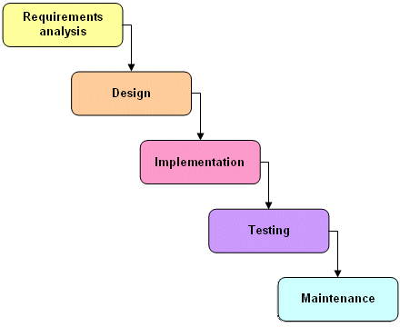

= Everything You Always Wanted To Know About ceps*
*But Were Afraid To Ask.

== 1. Hello, World!

The famous "Hello, World!" equivalent in ceps reads

 "Hello, World!";

This is only one character - not counting quotes - away from the minimum of the set of all possible "Hello, World!" programs footnote:[Assuming that
  any "Hello, World!" program must at least contain the string "Hello, World!", i.e. has no built-in "Hello, World!"-command.].
Above "program" footnote:[Set in quotes because a ceps document has no executable interpretation per se (we'll come to that shortly).] 
when stored in a file "hello_world.ceps"footnote:[Source code for all examples can be found in ceps/doc/examples.] can be "run"
footnote:[Put in quotes for the very same reason why we put "program" in quotes.] by typing 
the following line into a command-line interface footnote:[Shell on a UNIX like system (e.g. GNU/Linux), cmd.exe/Powershell on Windows.] footnote:[We assume your PATH variable is set properly - 
see Appendix A for further informations concerning the installation of ceps/sm4ceps.].

 ceps hello_world.ceps
 
The result - i.e. the printout on the console - should look like the following line.

 "Hello, World!"

The quotes being part of the output may indicate to the assertive reader that we are not dealing with a general programming language in the 
strict sense of the term here. Actually *ceps* hasn't even a notion of printing a string.

== 2. ceps = spec reversed.

_"The most important thing in the programming language is the name. 
A language will not succeed without a good name. 
I have recently invented a very good name and now I am looking for a suitable language."_
*_Donald Knuth_*

[[img-waterfallmodel]]

